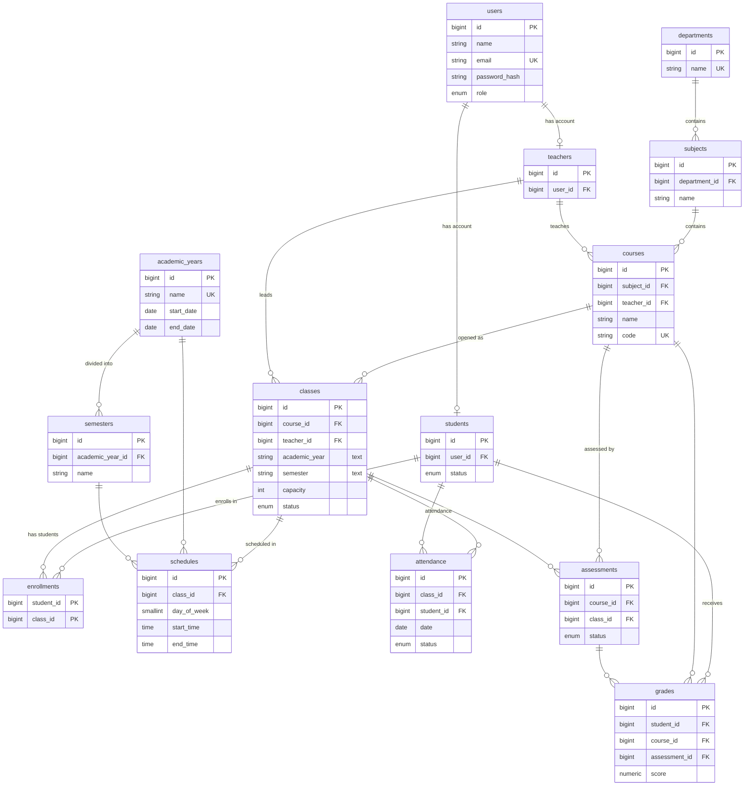
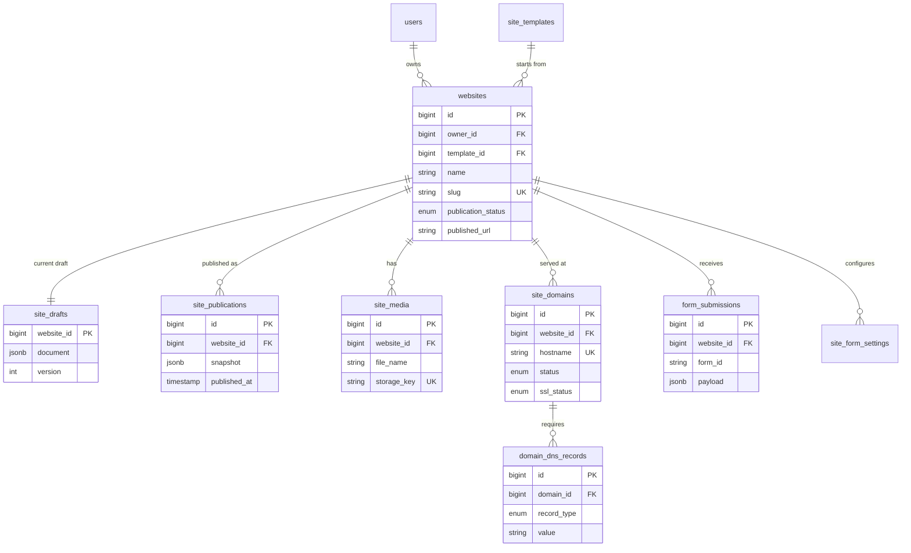

# ER diagram (academic part)

> GitHub renders this diagram automatically. In VS Code, install the
> "Markdown Preview Mermaid Support" extension and press Ctrl+Shift+V.

## How to read it
- `||--o{` means one-to-many (e.g. one department has many subjects).
- `PK` = primary key, `FK` = foreign key, `UK` = unique value.
- `enrollments` links students and classes (many-to-many).
- `classes.academic_year` and `classes.semester` are plain text by design.

# ER diagram (website builder part)

Run `schema-website-builder.sql` after `schema.sql`. The editor document
(sections, blocks, form definitions, motion, theme) is stored as JSON in
`site_drafts.document`.

