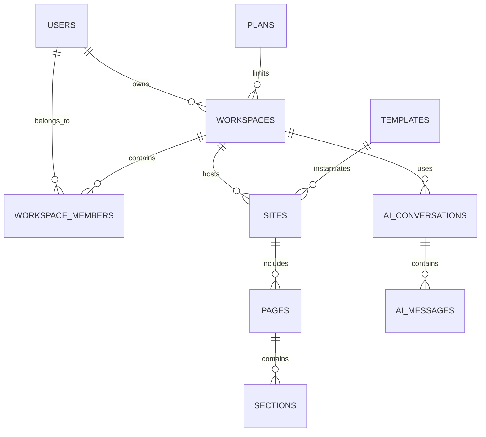

# Entity Relationship Diagram (ERD) - SiteBuilder

```mermaid
erDiagram
    USERS ||--o{ WORKSPACES : owns
    USERS ||--o{ WORKSPACE_MEMBERS : belongs_to
    PLANS ||--o{ WORKSPACES : limits
    WORKSPACES ||--o{ WORKSPACE_MEMBERS : contains
    WORKSPACES ||--o{ SITES : hosts
    WORKSPACES ||--o{ AI_CONVERSATIONS : uses
    TEMPLATES ||--o{ SITES : instantiates
    SITES ||--o{ PAGES : includes
    PAGES ||--o{ SECTIONS : contains
    AI_CONVERSATIONS ||--o{ AI_MESSAGES : contains
```